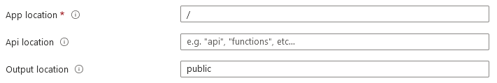
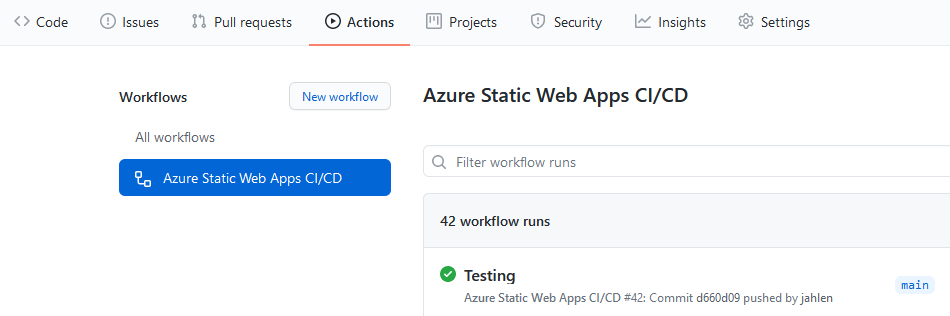
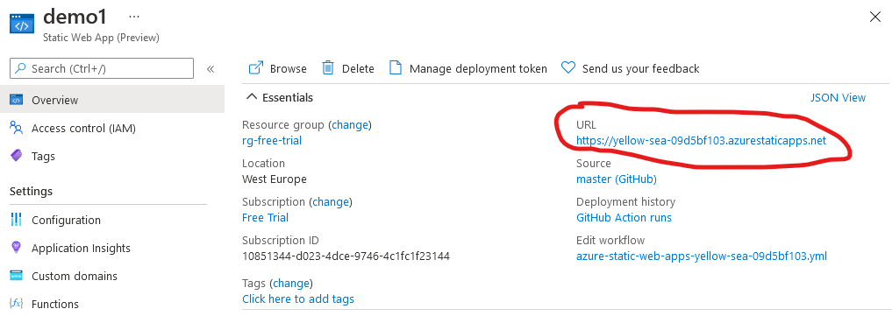
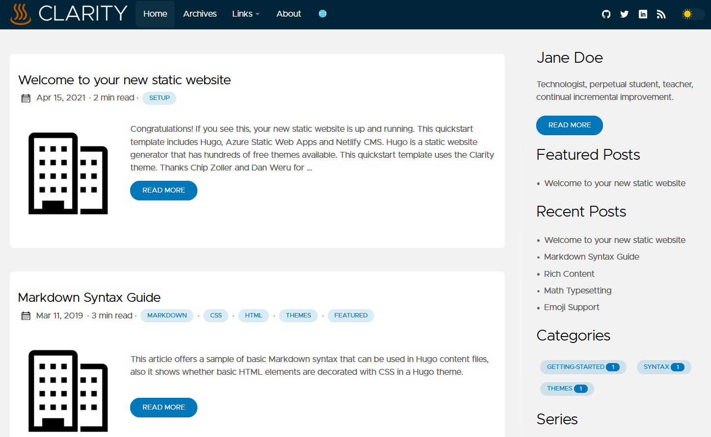
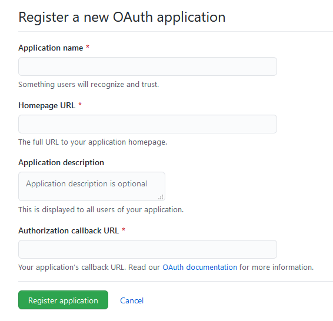
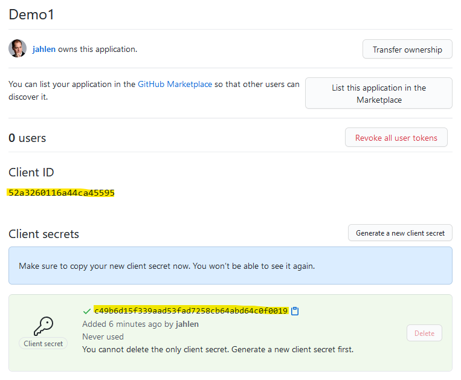
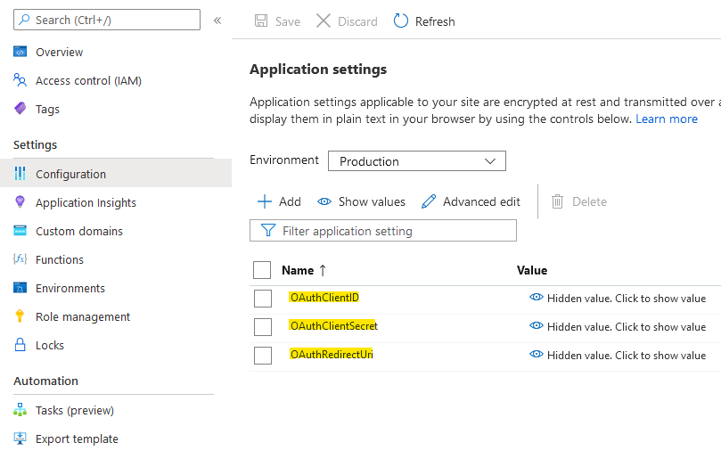

# Hugo / Azure Static Web Apps / Netlify CMS quickstart template

Create a static website with [Hugo](https://gohugo.io/), [Azure Static Web Apps](https://docs.microsoft.com/en-us/azure/static-web-apps/) and optionally [Netlify CMS](https://www.netlifycms.org/). For an example see [www.how2code.info](https://www.how2code.info).

* *Hugo* is a static website generator that has hundreds of free [themes](https://themes.gohugo.io/) available. This quickstart template uses the [Clarity](https://themes.gohugo.io/hugo-clarity/) theme. Thanks Chip Zoller and Dan Weru for your theme!
* *Azure Static Web Apps* is a feature-rich hosting service for static web apps. It offers custom domains, CDN, automatic certificates, API hosting, easy CI/CD setup, and many more benefits.
* *Netlify CMS* is a headless CMS (a content editor) that is compatible with most static website generators. It lives and stores content in your website GitHub repository. Setup is very easy.

Static websites ([Jamstack sites](https://www.jamstack.org)) have many benefits, including better performance, higher security and lower costs. Read [this article](https://www.how2code.info/en/blog/azure-static-web-apps-the-fast-and-secure-way-to-run-your-blog/) for an introduction to the Jamstack architecture.

# Instructions

## 1. Create your repository
Create your own copy of this repository. Visit [this link](https://github.com/jahlen/hugo-azure-static-webapp/generate) to create.

## 2. Create a Static Web App in the Azure Portal
In the [Azure Portal](https://portal.azure.com/), search for Static Web App and click Create. 

Sign in with your GitHub account. Fill in the yellow marked fields below with your own values:


Also fill in these yellow marked fields. *App location* should be */app* and *Api location* should be */api*.



Your Azure Static Web App should be created within a few minutes.

**Note: Your website will look like crap until you have edited the configuration files (step 5).**

## 3. (Optional) Add a custom domain in Azure

*Only if you already have a domain that you wish to use, for example www.mydomain.com*. 

In the Azure Portal / Static Web App, go to **Custom domains** under Settings and add it. Follow the instructions for configuring your DNS-server.

Wait a couple of minutes for your custom domain to be completely setup, including the HTTPS certificate.

## 4. Check your GitHub action

Azure should have created a GitHub action in your repository. Check that it executes successfully. It should be yellow while executing and green when finished.



## 5. Edit configuration files in your repo

In your GitHub repository, edit the following files:

* app/config/_default/config.toml
* app/config/_default/params.toml

Make sure to point **baseurl** to your website address (and don't forget the trailing slash). This could either be your custom domain, or the website address you were given by Azure Static Web Apps.

Here is how to find the URL in the Azure Portal (if you haven't used a custom domain instead).



## 6. Visit your website

Now visit your website! You should see something like this.



Note that the Admin-button at the bottom will not work until you have configured Netlify CMS.

## 7. Edit your website

See the [Hugo Clarity](https://github.com/chipzoller/hugo-clarity) documentation for instructions on how to customize your website.

You can edit the files under *app/content*. Instead of editing them manually, you can use Netlify CMS. There is an Admin-button in the page footer that will take you to Netlify CMS.

## 8. (Optional) Configure Netlify CMS

Netlify CMS depends on a backend API for authentication. This is handled by */api/OAuth.cs*, but it requires some configuration. If you wish to use Netlify CMS, you need to do these things:

1. Update the settings in *app/static/admin/config.yml*
2. Create a GitHub application
3. Configure your Azure Static Web App with the OAuth settings

### app/static/admin/config.yml

You will need to adjust the settings under *backend* and point them to your repository and domain.

### Create a GitHub application

Go to your GitHub [Developer settings](https://github.com/settings/developers). Click on New OAuth App.



* *Application name* can be anything you want
* *Homepage URL* can be anything you want
* *Authorization callback URL* must be something like https://www.yourwebsite.com/api/callback

After registering your app, click *Generate a new client secret*. Save a copy of your *Client ID* and *Client Secret* for use in the next step.



### Configure your Azure Static Web App with the OAuth settings

In the Azure Portal, you need to add these Application Settings to your Static Web App:



* *OAuthClientID* and *OAuthClientSecret* are the ones you previously received from GitHub when you created your GitHub application
* *OAuthRedirectUri* should be like https://www.yourwebsite.com/api/callback (same as you entered in GitHub)
* *OAuthState* should be just a long random string

Now try visiting https://www.yourwebsite.com/admin/ to open Netlify CMS.

## 9. (Optional) Setup local development environment

You can easily run and edit your website locally!

First [install Hugo](https://gohugo.io/getting-started/installing). 

Clone your GitHub repository locally. Either by using a tool like Visual Studio Code, or by command-line:

```
git clone https://github.com/yourusername/yourreponame.git
```

Open a command-prompt and go to the app directory of your local repository. Start the Hugo webserver:

```
hugo server -D
```

Hugo will tell you the local address of your website (usually http://localhost:1313).

Edit your website. Hugo will automatically trigger a rebuild of your website if any files change.

## Enjoy!!
